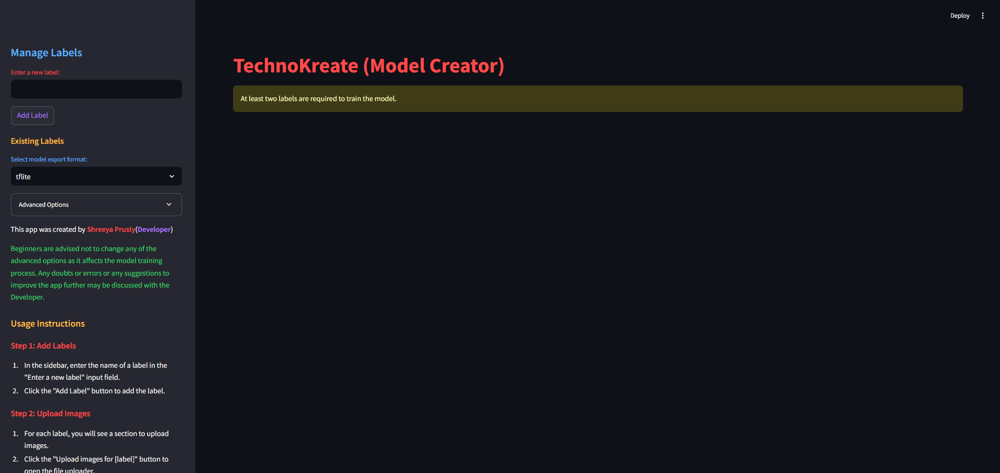
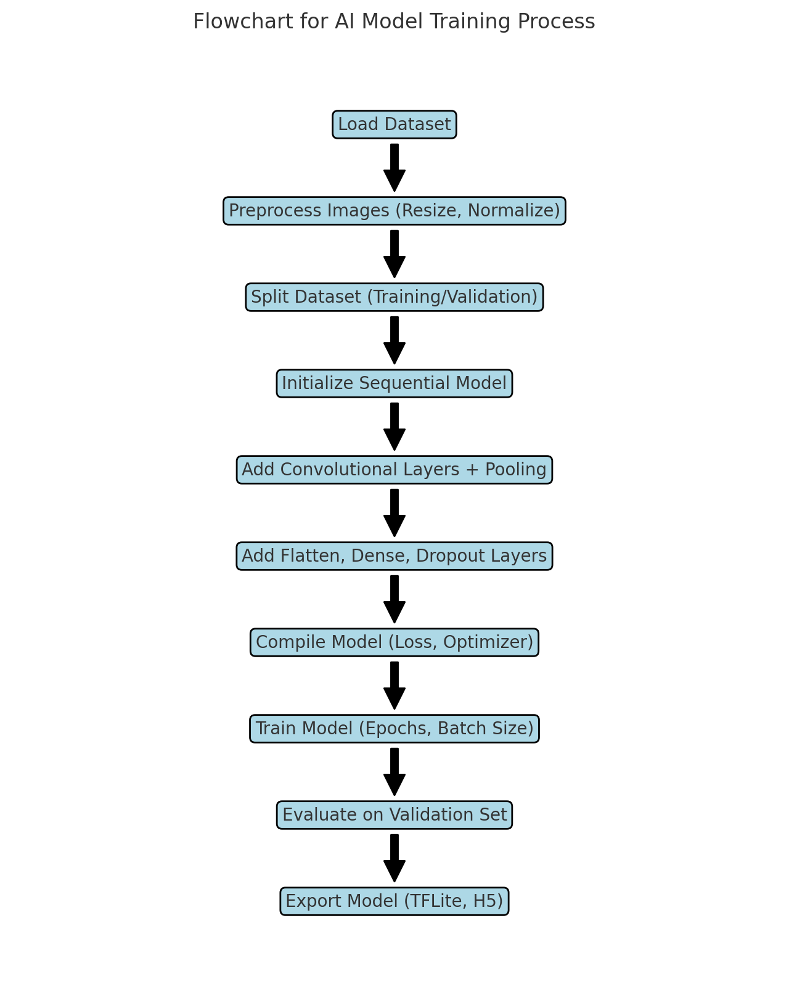

<!--    
    💻 My workspace
     -->
  
  
  
  
  
  
  
  
  
  
  
  
  
  
  
  
  
  
  
  

# TechnoKreate - AI Image Classification Model Creator

TechnoKreate is an advanced, user-friendly platform designed to help developers create, train, and download AI models for image classification tasks. With a clean and intuitive interface, users can manage their labels, upload images, train their custom model, and test it. The trained models can be downloaded in both TensorFlow Lite (.tflite) and H5 (.h5) formats, making it easy to deploy on various platforms.

The app is accessible at: [technokreate.streamlit.app](https://technokreate.streamlit.app)

## Features
1. **Manage Labels**: You can add custom labels and upload images corresponding to each label.
   
2. **Train Model**: Once images are uploaded for at least two labels, TechnoKreate allows you to train a custom CNN (Convolutional Neural Network) model.

3. **Test Model**: After training, you can upload a new image and test the model’s prediction accuracy with confidence levels.

4. **Download Model**: Export your trained model in TensorFlow Lite (.tflite) or H5 (.h5) formats, along with usage code, to integrate into other projects.

5. **Advanced Options**: You can configure the number of epochs for training and choose the model export format.

6. **Progress Tracking**: The model training is displayed with a real-time progress bar to track the training process.

7. **Usage Code**: Along with the model download, TechnoKreate generates usage code in Python to load and make predictions using the trained model.

## How to Use
1. **Add Labels**: In the sidebar, enter the name of a label and click "Add Label".
   
2. **Upload Images**: For each label, upload images that correspond to that category. 

3. **Train the Model**: Once you have uploaded images for at least two labels, click the "Train Model" button. The model will start training, and you can see the progress.

4. **Test the Model**: Upload an image to test the trained model, and view the predicted label with a confidence score.

5. **Download the Model**: After training, choose your desired export format (TensorFlow Lite or H5) and click the "Download Model" button to download the model along with the usage code.

## Note
TechnoKreate offers more advanced customizability and flexibility compared to beginner-friendly platforms like Teachable Machine. It’s perfect for developers who want more control over their model creation process. However, for those who prefer simplicity, platforms like Teachable Machine might be a better starting point.

## Warning
Occasionally, a "ghosting" effect may occur during code execution due to delays. Don't worry, as this is a normal occurrence with streamlit applications.

## Credits and Contributions
TechnoKreate was created by **Shreeya Prusty** (Developer).

# For Developers 

---

Explore TechnoKreate at [technokreate.streamlit.app](https://technokreate.streamlit.app)

